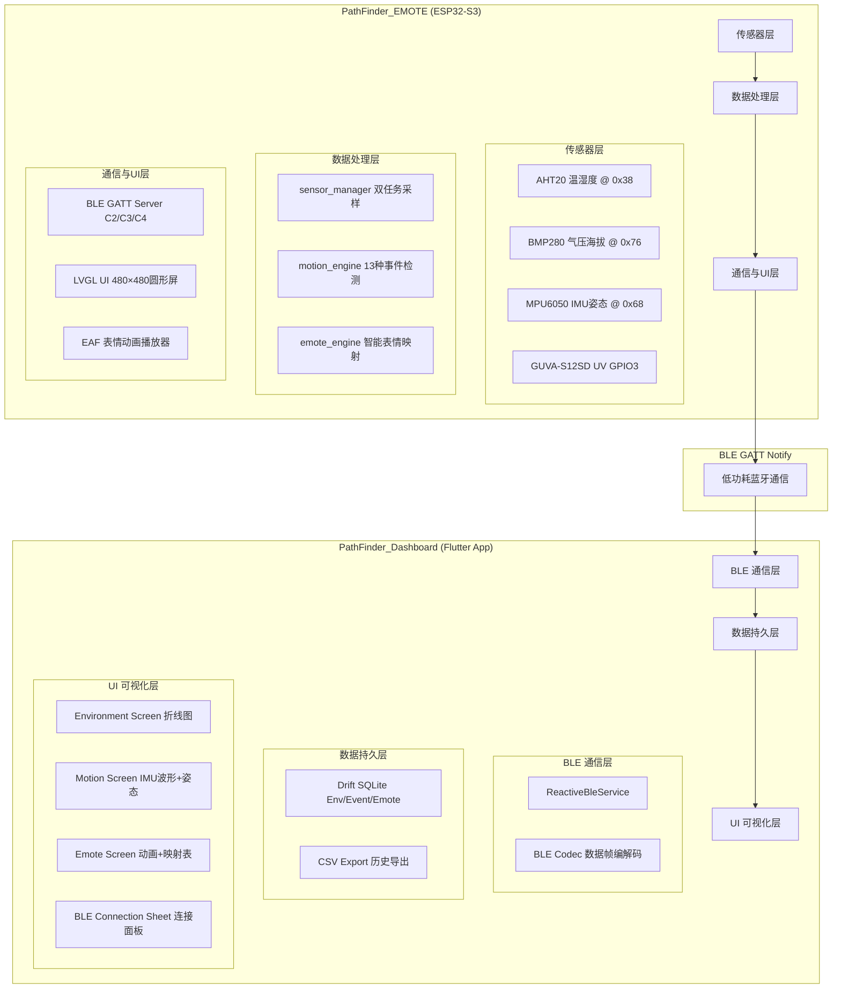
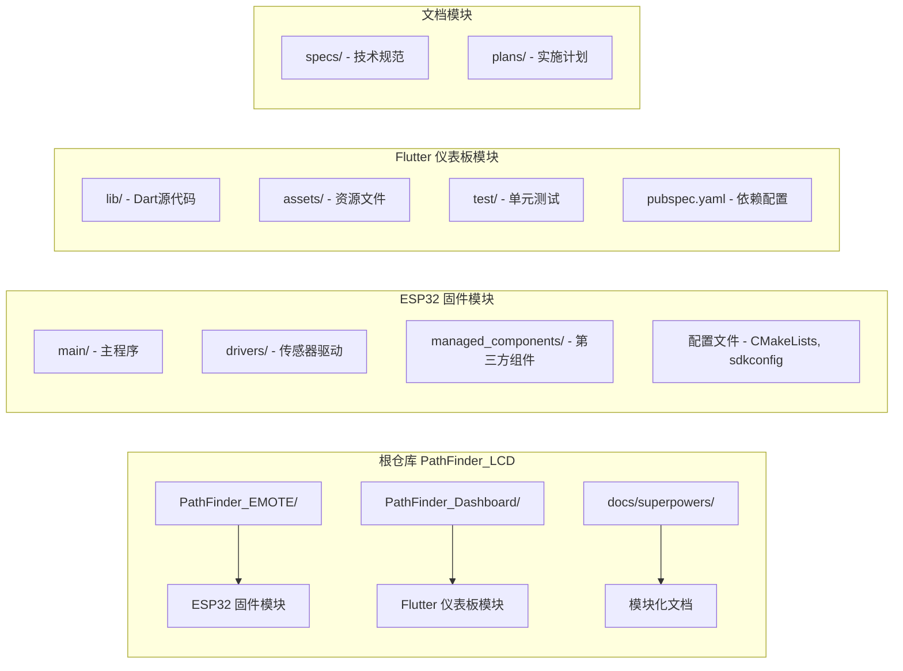

# 项目概述

<cite>
**本文引用的文件**   
- [README.md](file://README.md)
- [main.c](file://PathFinder_EMOTE/main/main.c)
- [CMakeLists.txt](file://PathFinder_EMOTE/CMakeLists.txt)
- [idf_component.yml](file://PathFinder_EMOTE/main/idf_component.yml)
- [2026-07-11-pathfinder-emote-phase1-implementation.md](file://docs/superpowers/specs/2026-07-11-pathfinder-emote-phase1-implementation.md)
- [2026-07-12-pathfinder-dashboard-flutter-design.md](file://docs/superpowers/specs/2026-07-12-pathfinder-dashboard-flutter-design.md)
- [2026-07-12-esp32-wifi-provisioning-impl-report.md](file://docs/superpowers/specs/2026-07-12-esp32-wifi-provisioning-impl-report.md)
</cite>

## 更新摘要
**变更内容**   
- 从单一路径结构重构为多设备生态系统框架
- 新增双端架构设计（ESP32固件 + Flutter仪表板）
- 模块化文档结构，每个设备类型独立管理
- 移除原有的根仓库架构设计，采用分布式项目管理

## 目录
1. [简介](#简介)
2. [系统架构](#系统架构)
3. [核心组件](#核心组件)
4. [技术栈与依赖](#技术栈与依赖)
5. [硬件要求与配置](#硬件要求与配置)
6. [开发环境搭建](#开发环境搭建)
7. [通信协议规范](#通信协议规范)
8. [部署与构建](#部署与构建)
9. [故障排查指南](#故障排查指南)
10. [后续规划](#后续规划)

## 简介

PathFinder_LCD 是一个完整的双端车载智能表情终端系统，已从传统的单一路径嵌入式应用重构为现代化的多设备生态系统框架。系统采用分布式架构设计，将功能拆分为独立的设备模块，每个模块拥有自己的代码库、文档和构建流程。

### 核心定位

从极简 EAF 表情播放器升级为**车载智能表情终端生态系统**：
- **PathFinder_EMOTE**：基于 ESP32-S3 的嵌入式固件端，集成多传感器采集、动态表情引擎、BLE 通信
- **PathFinder_Dashboard**：基于 Flutter 的 Android 仪表盘应用，实时可视化传感器数据与表情状态
- **模块化架构**：支持未来扩展更多设备类型（摄像头、音频模块等）

### 生态系统特性

- **解耦设计**：ESP32 固件与 Flutter App 通过 BLE 协议通信，松耦合架构
- **独立开发**：两个项目可独立编译、测试、部署
- **统一协议**：标准化的 BLE GATT 通信协议确保设备间互操作性
- **可扩展性**：模块化设计支持未来添加新的传感器和设备类型

## 系统架构

### 双端架构图



**图表来源**
- [README.md:23-71](file://README.md#L23-L71)
- [2026-07-11-pathfinder-emote-phase1-implementation.md:200-285](file://docs/superpowers/specs/2026-07-11-pathfinder-emote-phase1-implementation.md#L200-L285)

### 模块化架构设计

项目采用多设备生态系统框架，每个设备类型都有独立的代码结构和文档：



**图表来源**
- [README.md:498-580](file://README.md#L498-L580)

## 核心组件

### ESP32 固件端 (PathFinder_EMOTE)

#### Phase 1：传感器 + 动态表情联动 (已完成)

**1. 传感器驱动层 (drivers/)**
- ✅ `drv_aht20.c/h`：AHT20 温湿度传感器驱动（I2C @ 0x38）
- ✅ `drv_bmp280.c/h`：BMP280 气压海拔传感器驱动（I2C @ 0x76）
- ✅ `drv_mpu6050.c/h`：MPU6050 6DOF IMU 驱动（I2C @ 0x68）
- ✅ `drv_uv_adc.c/h`：GUVA-S12SD UV 传感器 ADC 驱动（GPIO3/ADC1_CH2）

**2. 传感器管理器 (sensor_manager.c/h)**
- ✅ 双任务采样架构（`env_task` 1Hz + `imu_task` 25Hz）
- ✅ I2C-1 总线初始化（GPIO12 SCL + GPIO14 SDA，400kHz）
- ✅ 线程安全数据缓冲与事件队列

**3. 运动分析引擎 (motion_engine.c/h)**
- ✅ 13 种运动事件检测：加减速、转向、垂直运动、异常、未知状态
- ✅ 基于加速度 + 陀螺仪阈值判定算法
- ✅ 事件队列推送给表情引擎

**4. 表情联动引擎 (emote_engine.c/h)**
- ✅ 运动事件 → 表情映射规则（13 种事件对应 EAF 动画）
- ✅ 环境异常触发（高 UV、大倾角 → 警告表情）
- ✅ 线程安全表情切换（LVGL 线程执行，避免竞态）

**5. BLE GATT Server (ble_gatt_server.c/h)**
- ✅ Service UUID：`0000fe00-...`（16-bit 格式）
- ✅ Characteristic C2：环境数据（温度、湿度、气压、海拔、UV）
- ✅ Characteristic C3：运动数据（IMU 原始 + 13 种事件）
- ✅ Characteristic C4：表情状态（动画 ID + 文字说明）

**6. LVGL UI (main.c + LCD.c + app_emote_assets.c)**
- ✅ 480×480 圆形屏显示（ST7701S RGB565）
- ✅ EAF 表情动画居中最大化（330×330）
- ✅ 胶囊式数据条（顶部环境、底部姿态）
- ✅ 点击唤出数据条（3 秒淡出）

#### Wi-Fi 配网功能 (已完成)
- ✅ BLE 配网：App 发送 JSON 凭据到新增 C5 Write 特征值
- ✅ Web 配网：Captive Portal（手机连 AP 热点自动弹出配置网页）
- ✅ NVS 统一存储层设计
- ✅ 内存预算验证（Web Portal 瞬态占用 ~33KB SRAM）

### Flutter App 端 (PathFinder_Dashboard)

#### 完整应用架构 (已完成)

**1. 项目结构**
- ✅ 分层架构（`app/`、`core/`、`features/`、`shared/`）
- ✅ Racing Dark 主题系统（Material Design 3）
- ✅ 4 Tab 导航架构（Environment、Motion、Emote、History）
- ✅ GoRouter 路由配置

**2. BLE 通信层 (core/ble/)**
- ✅ `ReactiveBleService`：真实 BLE 设备连接服务
- ✅ `MockBleService`：开发测试 Mock 数据源
- ✅ `ble_codec.dart`：数据帧编解码（严格对齐 ESP32 C 结构体）
- ✅ `ble_uuids.dart`：Service/Characteristic UUID 常量

**3. 数据持久层 (core/storage/)**
- ✅ Drift SQLite ORM
- ✅ 3 张数据表：EnvSnapshot、MotionEvent、EmoteInfo
- ✅ DAO 层和数据访问接口
- ✅ CSV 导出功能

**4. UI 可视化层 (features/)**
- ✅ Environment Screen：5个Metric Card + 折线图历史趋势
- ✅ Motion Screen：姿态指示器 + IMU波形图 + 运动事件时间轴
- ✅ Emote Screen：当前表情动画展示 + 表情映射表 + 表情画廊
- ✅ BLE Connection UI：底部弹窗连接面板 + 设备扫描列表

## 技术栈与依赖

### ESP32 固件端技术栈

| 层 | 技术 | 版本 | 用途 |
|----|------|------|------|
| SDK | ESP-IDF | v6.0+ | 官方开发框架 |
| GUI | LVGL | 8.3.11 | 嵌入式图形库 |
| 动画 | EAF | ESP-IDF component | 表情动画播放器 |
| 存储 | NVS | ESP-IDF native | 非易失性存储 |
| BLE | NimBLE | ESP-IDF native | 低功耗蓝牙 |
| ADC | esp_adc | ESP-IDF v6.0 | ADC 校准 API |

### Flutter App 端技术栈

| 层 | 库 | 版本 | 用途 |
|----|----|------|------|
| 框架 | Flutter | >=3.8.0 | Android 应用框架 |
| 状态管理 | flutter_riverpod | ^2.6.1 | 编译时安全流式数据 |
| BLE | flutter_reactive_ble | ^5.3.1 | 纯 Dart BLE 通信 |
| 图表 | fl_chart | ^0.70.2 | 折线图/波形图 |
| 数据库 | drift | ^2.22.1 | 类型安全 SQL ORM |
| 导航 | go_router | ^14.8.1 | 声明式路由 |

### 关键依赖配置

**ESP32 组件依赖 (idf_component.yml)**
```yaml
dependencies:
  idf: ">=5.5"
  lvgl/lvgl: "~8.3.0"
  espressif/esp_mmap_assets: "^2.0.0"
  espressif/esp_lv_eaf_player: "^0.3.0"
  espressif/cjson: "^1.7.18"
```

**Flutter 依赖 (pubspec.yaml)**
```yaml
dependencies:
  flutter:
    sdk: flutter
  flutter_riverpod: ^2.6.1
  flutter_reactive_ble: ^5.3.1
  fl_chart: ^0.70.2
  drift: ^2.22.1
  sqlite3_flutter_libs: ^0.5.28
  go_router: ^14.8.1
```

**章节来源**
- [idf_component.yml:1-7](file://PathFinder_EMOTE/main/idf_component.yml#L1-L7)
- [2026-07-12-pathfinder-dashboard-flutter-design.md:110-122](file://docs/superpowers/specs/2026-07-12-pathfinder-dashboard-flutter-design.md#L110-L122)

## 硬件要求与配置

### ESP32-S3 引脚分配

#### LCD RGB 面板（ST7701S，480×480）
| ESP32-S3 引脚 | LCD 信号 | 说明 |
|---------------|----------|------|
| GPIO 0 | R3 | 红色位 3 |
| GPIO 2 | PCLK | 像素时钟 |
| GPIO 4-7 | B0-B3 | 蓝色位 0-3 |
| GPIO 9-11 | G4-G5 | 绿色位 4-5 |
| GPIO 15-17 | B4/G0-G1 | 蓝色 4 / 绿色 0-1 |
| GPIO 18 | G3 | 绿色位 3 |
| GPIO 21 | R4 | 红色位 4 |
| GPIO 41 | HSYNC | 行同步 |
| GPIO 42 | DE | 数据使能 |
| GPIO 46 | VSYNC | 场同步 |
| GPIO 45-48 | R1-R3/G6-G7 | 红色 1-3 / 绿色 6-7 |

#### 触摸 CST3530（I2C-0）
| ESP32-S3 引脚 | 信号 | 说明 |
|---------------|------|------|
| GPIO 13 | SCL | I2C 时钟 |
| GPIO 20 | SDA | I2C 数据 |
| GPIO 8 | INT | 触摸中断 |

#### 传感器 I2C-1 总线（400kHz）
| ESP32-S3 引脚 | 信号 | 说明 |
|---------------|------|------|
| GPIO 12 | SCL | I2C 时钟 |
| GPIO 14 | SDA | I2C 数据 |
| GPIO 3 | ADC1_CH2 | UV 模拟输入 |

#### I2C 设备地址分配
| 设备 | I2C 地址 | 说明 |
|------|----------|------|
| AHT20 | 0x38 | 温湿度传感器 |
| BMP280 | 0x76 | 气压海拔传感器 |
| MPU6050 | 0x68 | 6DOF IMU |
| CST3530 | 0x58 | 触摸屏（I2C-0） |

### 硬件平台规格
- **主控**：ESP32-S3-WROOM-1（16MB Flash, Octal PSRAM 80MHz）
- **LCD**：ST7701S RGB565 圆形屏（480×480）
- **触摸**：CST3530 电容触摸
- **传感器**：AHT20+BMP280 一体模块 + GY-521 MPU6050 + GUVA-S12SD UV

## 开发环境搭建

### ESP32 固件构建环境

**环境配置**
```bash
# 安装 ESP-IDF v6.0+
git clone -b v6.0 --recursive https://github.com/espressif/esp-idf.git
cd esp-idf
./install.sh esp32s3
source export.sh
```

**构建与烧录**
```bash
cd PathFinder_EMOTE

# 清理构建（修复引脚冲突后必须执行）
idf.py fullclean

# 编译固件
idf.py build

# 烧录固件 + 资源分区
idf.py -p /dev/cu.usbmodem5AF61192361 flash

# 监控日志
idf.py -p /dev/cu.usbmodem5AF61192361 monitor
```

**资源烧录**
```bash
# 烧录 EAF 表情资源分区（emote-assets.bin @ 0x410000）
esptool.py --port /dev/cu.usbmodem5AF61192361 \
  write_flash 0x410000 emote-assets.bin
```

### Flutter App 构建环境

**依赖安装**
```bash
cd PathFinder_Dashboard
flutter pub get
```

**生成 Drift 代码**
```bash
# 生成数据库 DAO 代码
dart run build_runner build
```

**运行应用**
```bash
# 开发模式（连接 Mock BLE）
flutter run

# 生产模式（连接真实设备）
flutter run --release
```

**构建 APK**
```bash
flutter build apk --release
```

## 通信协议规范

### BLE GATT Service 结构
```
Service UUID: 0000fe00-0000-1000-8000-00805f9b34fb
├── C2 Environment Data   (NOTIFY @1Hz)        UUID: 0000fe02-...
├── C3 Motion Data        (NOTIFY @25Hz)       UUID: 0000fe03-...
├── C4 Emote State        (NOTIFY @on-change)  UUID: 0000fe04-...
└── C5 WiFi Provisioning  (WRITE/NOTIFY)       UUID: 0000fe05-...
```

### 数据帧格式

**C2 环境数据帧（16 字节）**
```
Offset | Field       | Type   | Unit  | Description
-------|-------------|--------|-------|-------------
0      | temperature | int16  | 0.01°C| 温度（-40~85°C）
2      | humidity    | uint16 | 0.01% | 湿度（0~100%）
4      | pressure    | uint32 | Pa    | 气压（300~1100 hPa）
8      | altitude    | int32  | m     | 海拔（-500~9000m）
12     | uv_index    | uint16 | 0.01  | UV 指数（0~11+）
14     | reserved    | uint16 | -     | 保留
```

**C3 运动数据帧（32 字节）**
```
Offset | Field       | Type   | Unit    | Description
-------|-------------|--------|---------|-------------
0      | accel[3]    | float[3]| g      | 加速度 X/Y/Z
12     | gyro[3]     | float[3]| °/s    | 陀螺仪 X/Y/Z
24     | roll        | float  | °       | Roll 角
28     | pitch       | float  | °       | Pitch 角
32     | yaw         | float  | °       | Yaw 角
36     | event_id    | uint8  | -       | 运动事件 ID（0~12）
37     | reserved    | uint8[7]| -      | 保留
```

**C4 表情状态帧（8 字节）**
```
Offset | Field       | Type   | Description
-------|-------------|--------|-------------
0      | emote_id    | uint8  | 表情动画 ID（0~22）
1      | name_len    | uint8  | 表情名称长度
2-7    | name        | char[6]| 表情名称（如 "panic"）
```

### 运动事件映射表
| Event ID | 名称 | 触发条件 | 对应表情 |
|----------|------|----------|----------|
| 0 | 急加速 | Accel > 0.3g | confident_08 |
| 1 | 急减速 | Accel < -0.3g | shocked_05s |
| 2 | 正常加速 | 0.1g < Accel < 0.3g | smile_05s |
| 3 | 正常减速 | -0.1g < Accel < -0.3g | sigh_20s |
| 4 | 左转 | Gyro_Z > 30°/s | shy_20s |
| 5 | 右转 | Gyro_Z < -30°/s | shy_20s |
| 6 | 急左转 | Gyro_Z > 60°/s | panic_05s |
| 7 | 急右转 | Gyro_Z < -60°/s | panic_05s |
| 8 | 上坡 | Pitch > 10° | leisure_05s |
| 9 | 下坡 | Pitch < -10° | investigate |
| 10 | 颠簸 | Accel variance > 0.2g² | mock_05s |
| 11 | 碰撞 | Accel peak > 2g | angry_20s |
| 12 | 静止 | Motion < threshold | asleep_215s |

## 部署与构建

### 项目统计

#### 代码量统计
- **ESP32 固件**：14 个源文件（7 模块 × 2），1247 行主程序代码
- **Flutter App**：44 个 Dart 文件，分层架构完整
- **文档**：5 个 Spec 文档，详细设计与实现记录

#### 编译结果
- **固件大小**：581KB
- **分区占用**：86%（Flash 分区空间）
- **资源分区**：emote-assets.bin @ 0x410000

#### 测试覆盖
- **Flutter 单元测试**：19/19 通过（P0 协议 + P1 DAO + P2 Widget）
- **ESP32 固件验证**：编译、烧录、显示、BLE 连接全通过

### 文件系统结构

#### ESP32 固件端
```
PathFinder_EMOTE/
├── main/
│   ├── main.c                  # 主程序入口
│   ├── LCD.c/h                 # LCD 驱动
│   ├── app_emote_assets.c/h    # EAF 表情资源管理
│   ├── sensor_manager.c/h      # 传感器管理器
│   ├── motion_engine.c/h       # 运动分析引擎
│   ├── emote_engine.c/h        # 表情联动引擎
│   ├── ble_gatt_server.c/h     # BLE GATT Server
│   ├── drivers/                # 传感器驱动
│   │   ├── drv_aht20.c/h
│   │   ├── drv_bmp280.c/h
│   │   ├── drv_mpu6050.c/h
│   │   ├── drv_uv_adc.c/h
│   ├── CMakeLists.txt          # ESP-IDF 构建配置
│   ├── Kconfig.projbuild       # 配置选项
│   └── idf_component.yml       # 组件依赖
├── managed_components/         # ESP-IDF managed components
├── sdkconfig.defaults          # SDK 默认配置
├── partitions.csv              # Flash 分区表
├── emote-assets.bin            # EAF 表情资源分区
└── CMakeLists.txt              # 项目构建入口
```

#### Flutter App 端
```
PathFinder_Dashboard/
├── lib/
│   ├── main.dart
│   ├── app/                    # 应用配置
│   ├── core/                   # 核心功能
│   ├── features/               # 功能模块
│   ├── shared/                 # 共享组件
├── assets/                     # 资源文件
├── test/                       # 单元测试
├── pubspec.yaml
└── README.md
```

## 故障排查指南

### ESP32-S3 引脚冲突修复
**问题**：启用 USB-CDC 控制台导致 LCD 黑屏，串口无日志输出  
**根因**：USB-CDC 占用 GPIO19/GPIO20，而 LCD SPI 数据线使用 GPIO20  
**修复**：
```diff
- CONFIG_ESP_CONSOLE_USB_CDC=y
+ CONFIG_ESP_CONSOLE_UART_DEFAULT=y
```
执行 `idf.py fullclean` + rebuild + flash

### BLE UUID 格式修复
**问题**：Flutter App 无法扫描到 ESP32 BLE 设备  
**根因**：ESP32 使用 128-bit UUID，Flutter 扫描 16-bit UUID  
**修复**：
```c
// NimBLE 中 16-bit UUID 必须用 BLE_UUID16_INIT
BLE_UUID16_INIT(BLE_UUID16_DECLARE(0xfe02))
```

### Broadcast Stream 初始值修复
**问题**：Flutter UI 卡在 loading 状态，StreamProvider 无数据  
**根因**：Broadcast stream 不缓存初始值，订阅延迟丢失  
**修复**：
```dart
// 使用 async* getter + _currentState 缓存
Stream<ConnectionState> get connectionState async* {
  yield _currentState;
  await for (final state in _connectionStream) {
    _currentState = state;
    yield state;
  }
}
```

### MPU6050 花屏修复
**问题**：接入 MPU6050 后 LCD 显示花屏/闪烁  
**根因**：IMU 高频采样 + 单帧缓冲导致渲染竞态  
**修复**：启用双帧缓冲（`CONFIG_LCD_RGB_BUFFER_NUM=2`）

### Wi-Fi 配网问题
**问题**：Captive Portal 页面不弹出或显示空白  
**根因**：DNS 劫持缺失或 HTTP 重定向不被跟随  
**修复**：
- 添加 DNS 劫持服务器（UDP 端口 53）
- 直接返回 HTML 内容而非 302 重定向
- 增加 HTTP 请求头长度限制至 2048 字节

## 后续规划

### Phase 2：音视频 + AI 语音助手（规划中）
- ⏳ OV2640 摄像头集成（人脸追踪云台）
- ⏳ ES8311 + NS4150B 音频模块集成
- ⏳ xiaozhi-esp32 AI 语音助手接入
- ⏳ Wi-Fi 双模配网实现（BLE + Web Captive Portal）
- ⏳ 摄像头人脸追踪转向功能（双 MG90S 舵机云台）

### Phase 3：高级功能（待规划）
- ⏳ 云端数据同步
- ⏳ 多设备协同
- ⏳ OTA 固件升级
- ⏳ 触摸屏配网功能

### 生态系统扩展
- ⏳ 支持更多传感器类型
- ⏳ 跨平台 Flutter 应用（iOS/Web/Desktop）
- ⏳ 云端数据分析平台
- ⏳ 多设备集群管理

---

**项目路径**：``  
**固件项目**：`PathFinder_EMOTE/`  
**App 项目**：`PathFinder_Dashboard/`  
**文档路径**：`docs/superpowers/specs/`  

**后续更新**：基于此 README.md 文档进行迭代，记录新增功能模块与修复经验。

**许可证**：本项目遵循 LICENSE 文件规定的开源协议。